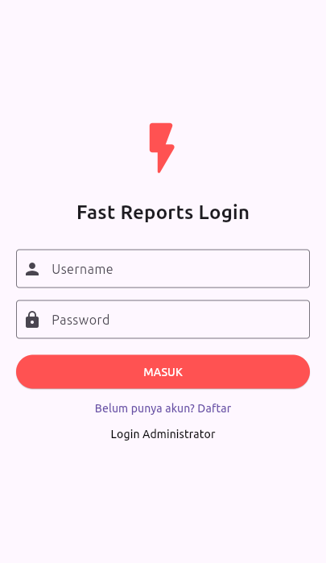
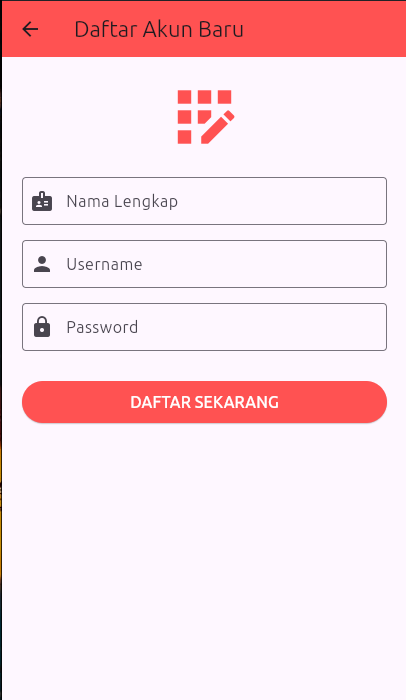
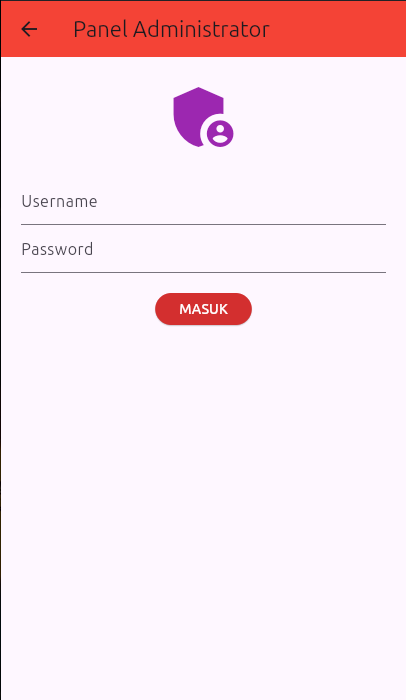
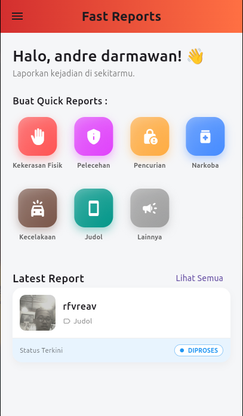
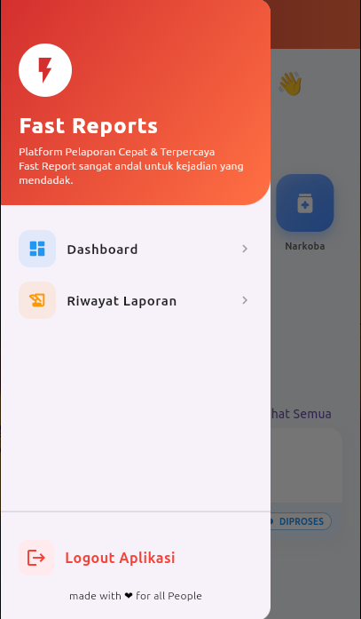
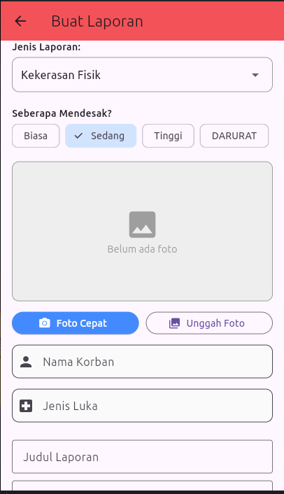
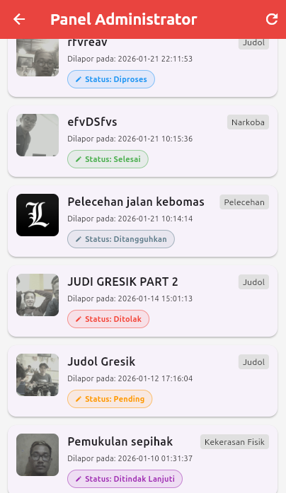
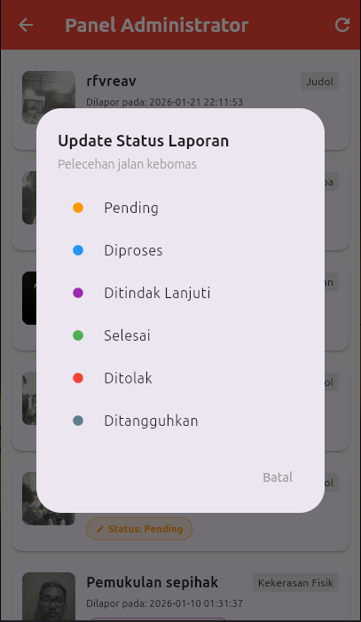
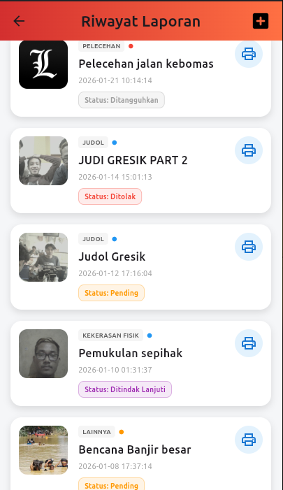
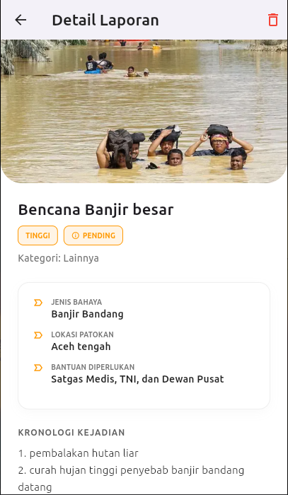

# 🚀 FAST Reports (Flutter Automated Safety & Tracking Reports)


**FAST Reports** adalah aplikasi pelaporan insiden multi-platform (Mobile & Desktop) yang dirancang untuk kecepatan dan ketepatan data. Aplikasi ini memungkinkan pengguna melaporkan kejadian darurat (Kecelakaan, Kriminal, Judol, Narkoba) dengan bukti visual realtime dan formulir yang adaptif.

---

## ✨ Fitur Unggulan

### 📱 1. User Side (Pelapor)

- **Dynamic Form System:** Formulir input berubah otomatis sesuai kategori laporan.
  - _Contoh:_ Kategori "Kecelakaan" meminta data kendaraan, sedangkan "Judol" meminta link situs/rekening.
- **Hybrid Camera Engine:**
  - 📸 **Android:** Menggunakan Native Camera API.
  - 💻 **Linux Desktop:** Mengintegrasikan `fswebcam` driver untuk dukungan webcam laptop/eksternal.
- **Real-time Status Tracking:** Memantau status laporan (Pending ➝ Diproses ➝ Selesai) secara langsung.
- **Export Evidence:** Fitur cetak bukti laporan ke format `.txt` untuk arsip fisik.
- **Offline Capability:** Login session tersimpan (Auto-login).

### 🛡️ 2. Admin Panel (Pengelola)

- **Integrated Dashboard:** Panel admin menyatu dalam satu aplikasi (Role-Based Access).
- **Status Management:** Admin dapat mengubah status laporan (`Diproses`, `Ditindak Lanjuti`, `Selesai`, `Ditolak`) dan user akan melihat perubahannya seketika.
- **Quick Review:** Melihat detail laporan lengkap dengan foto bukti dan metadata lokasi.

---

## 🛠️ Teknologi yang Digunakan

- **Frontend:** Flutter (Dart) dengan Clean Architecture (Presentation, Domain, Data layers).
- **Backend:** PHP Native (REST API).
- **Database:** MySQL / MariaDB.
- **State Management:** Provider.
- **Tools:** Android Studio, VS Code, XAMPP (Windows) / Apache (Linux).

---

## 📸 Screenshots

|              Dashboard User               |             Detail Laporan             |              Panel Admin              |
| :---------------------------------------: | :------------------------------------: | :-----------------------------------: |
| _(Tempatkan Screenshot Dashboard Disini)_ | _(Tempatkan Screenshot Detail Disini)_ | _(Tempatkan Screenshot Admin Disini)_ |

---

## ⚙️ Instalasi & Pengaturan

### 1. Persiapan Backend (Server)

1.  Pastikan **XAMPP** (Windows) atau **Apache/Nginx** (Linux) sudah terinstall.
2.  Buat database baru di PHPMyAdmin bernama `fast_reports`.
3.  Import file SQL yang disertakan (`fast_reports.sql`) ke database tersebut.
4.  Pindahkan folder `backend/fast_api` ke folder `htdocs` (Windows) atau `/var/www/html` (Linux).

### 2. Konfigurasi Aplikasi (Flutter)

Buka file `lib/core/constants/api_constants.dart` dan sesuaikan IP Address:

**Untuk Android Emulator:**

````dart
static const String serverIp = "10.0.2.2"; // Akses ke localhost Windows

**Untuk HP Fisik / Linux Desktop:**

```dart
static const String serverIp = "192.168.x.x"; // Sesuaikan IP LAN Laptop Anda
// atau
static const String serverIp = "localhost"; // Jika run di Desktop Linux

# Menjalankan Aplikasi :

# Install dependencies
flutter pub get

# Run di Android Emulator
flutter run

# Run di Linux Desktop (Pastikan install fswebcam: sudo apt install fswebcam)
flutter run -d linux

🔐 Akun Demo

Role,Username,Password
User,(Register manual di aplikasi),(Sesuai register)
Admin,admin,admin123

📂 Struktur Proyek

lib/
├── core/            # Konstanta API & Helper (Camera, Printer)
├── data/            # Models & Remote Data Source (HTTP Request)
├── domain/          # Entities & Repository Interfaces
└── presentation/    # UI (Pages, Widgets) & State Management (Providers)

👨‍💻 Author

Dikembangkan oleh Andri Darmawan (3012310004) sebagai Proyek Akhir Mata Kuliah Pemrograman Aplikasi Mobile.

# Screenshot cuplikan Aplikasi:

## Login & Register:







## Dashboard Apps :











## Riwayat & Detail Laporan:





````
